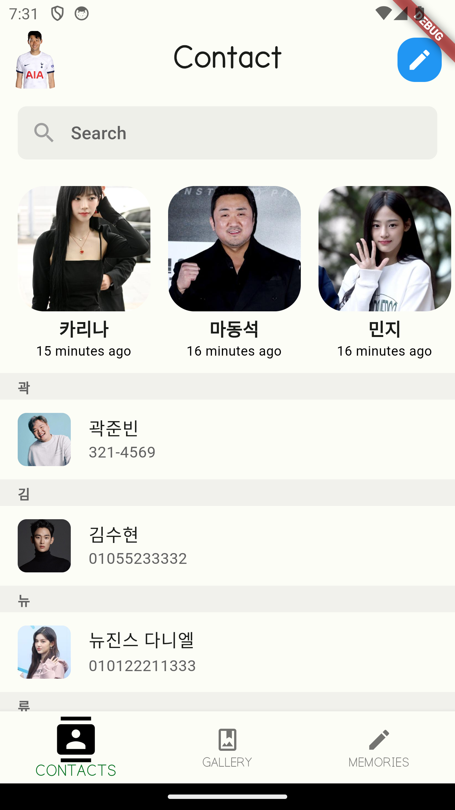
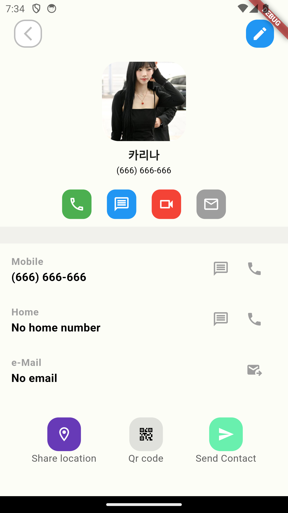
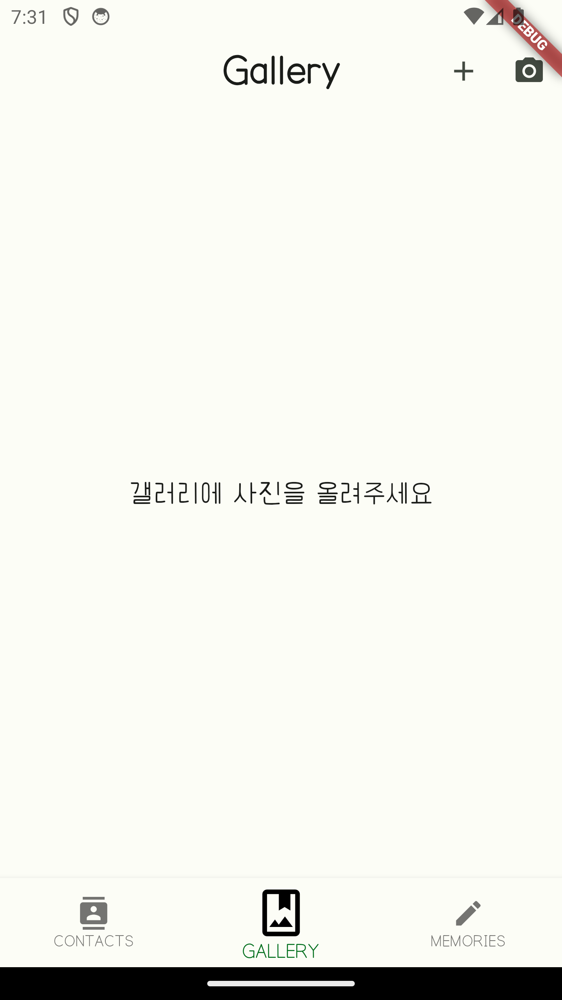
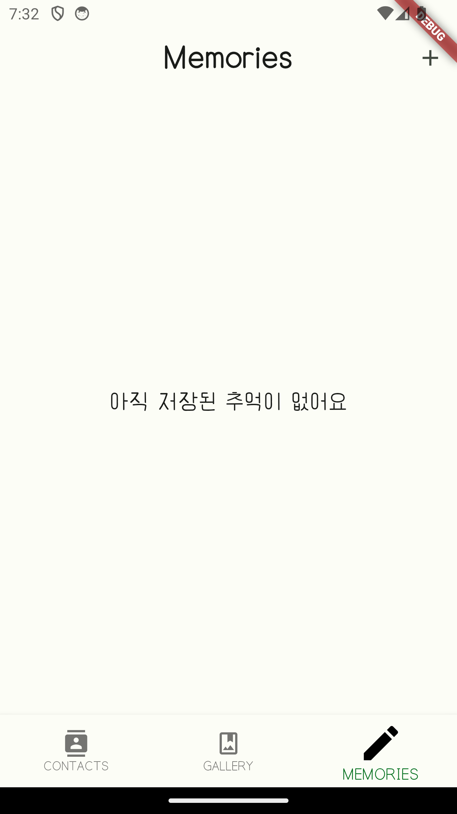
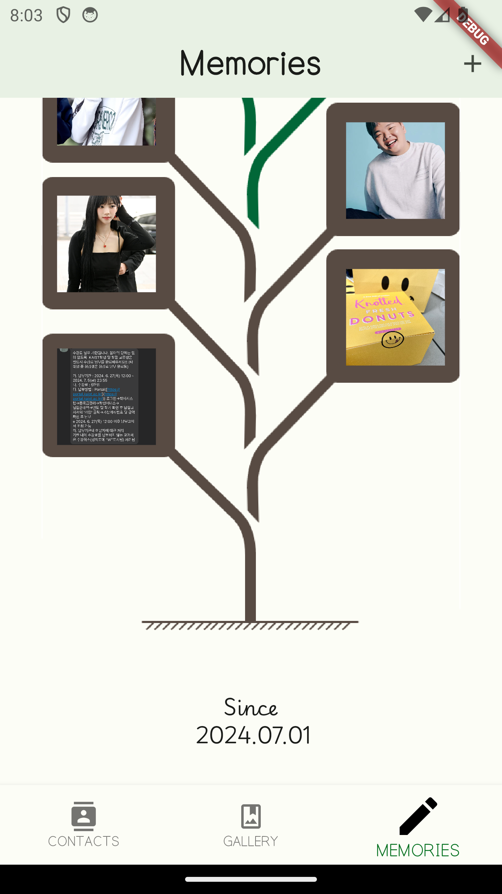

# 프로젝트 이름

**프로젝트 설명**
한 줄 소개: 이 프로젝트는 Flutter를 사용하여 제작한 연락처, 갤러리, 추억 일기 애플리 케이션 입니다.  
슬로건: "술 마시고 늦게 오지 말기"  
사용된 기술: Flutter, Dart  
페이지별 기능:  
- **연락처 화면**: 쉽고 편리한, 연락처 화면 제공
- **갤러리 화면**: 사용자가 추가한 갤러리 이미지 저장 및 확대기능 
- **추억 화면**: 무한히 자라는 추억 식물을 키우세요!

## 팀원
- **팀원1**: 이시준 (mac520@naver.com)
- **팀원2**: 배준형 (email@example.com)

## 미리보기

## 동영상 데모
[프로젝트 데모 영상](https://www.youtube.com/watch?v=your_demo_video_link)

## APK 파일
[APK 다운로드](https://drive.google.com/file/d/your_apk_file_link/view?usp=sharing)
